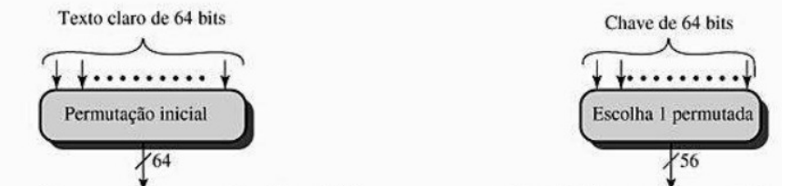
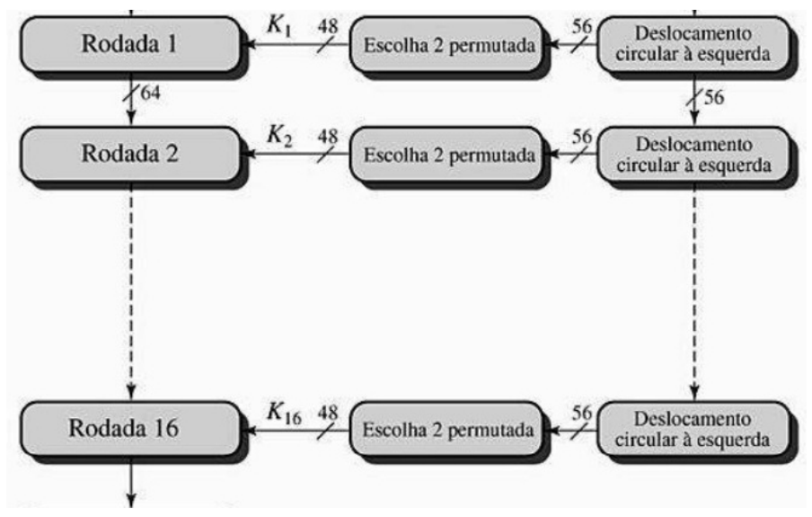
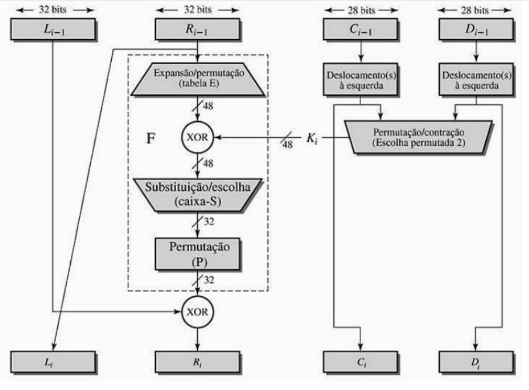
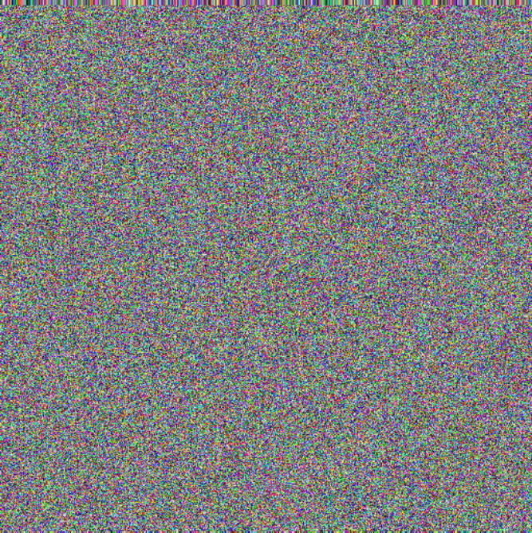
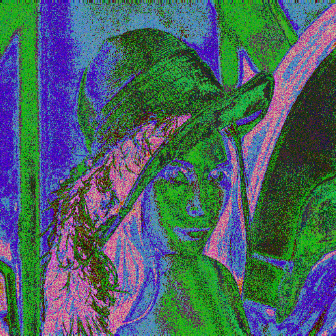

# Criptografia de imagem utilizando o método Data Encryption Standard (DES)

## Resumo

Este artigo busca explicar e demonstrar o funcionamento do método criptográfico Data Encyption Standard (DES). Para a demostração será utilizada a clássica imagem da Lena Söderberg. A criptografia será feita com o DES, DES sem nenhuma iteração, DES com uma iteração e o DES com a chave ”zerada” em todas as iterações.

## 1. Informações Gerais

O DES é um método de criptografia que transforma blocos de 64bits de texto claro em texto confuso. Para essa transformação são efetuadas uma série de complicadas operações. Essas operações envolvem uma chave, também de 64bits, que é usada tanto para encriptar, quanto para decriptar uma mensagem, ou no caso, uma imagem. A imagem utilizada nesse artigo será a clássica foto da Lena Söderberg, largamente utilizada em experimentos que envolvem processamento de imagem desde 1973.

<p align="center">
  
  <br>
  <b>Figure 1. Lena Söderberg. Playboy Magazine. November 1972</b>
</p>

## 2. Algoritmo de encriptação DES

A seguir partes do código implementado por Ajit kumar será mostrado. O código completo está hospedado em https://github.com/gustavofariaa/EncryptImage.

## 2.1. Inicializando

<p align="center">
  
  <br>
  <b>Figure 2. Escolha permutada/ Permutação inicial</b>
</p>

A escolha permutada, tem como entrada uma chave de 64bits, usada tanto para criptografar como descriptografar o texto claro. Com isso essa chave passa por um processo que faz a escolha de alguns bits retornando uma chave de 56bits.

```python
def generate_keys(key_64bits):
  round_keys = list()
  pc1_out = apply_PC1(PC1, key_64bits)
  L0, R0 = split_in_half(pc1_out)
  for roundnumber in range(16):
    newL = circular_left_shift(L0, ROUND_SHIFTS[roundnumber])
    newR = circular_left_shift(R0, ROUND_SHIFTS[roundnumber])
    roundkey = apply_compression(PC2, newL+newR)
    round_keys.append(roundkey)
    L0 = newL
    R0 = newR
  return round_keys
```

A permutação inicial consiste em um bloco de 64bits do texto claro, cada bit é numerado de 1 a 64. A permutação é feita e a saı́da é o bloco de 64bit permutado.

```python
def apply_initial_p1(P_TABLE, PLAINTEXT):
  permutated_M = ""
  for index in P_TABLE:
    permutated_M += PLAINTEXT[int(index)-1]
  return permutated_M
```

## 2.2. Rodadas

<p align="center">
  
  <br>
  <b>Figure 3. Dezesseis rodadas</b>
</p>

Nesta etapa a primeira iteração recebe o bloco de 64bits vindo da permutação inicial. A cada rodada é feito um processamento e um novo bloco de 64bits é passado para a próxima rodada, até que seja concluı́da as 16 interações.

```python
for round in range(16):
  if zero_key:
    roundkeys[round] = ZERO_KEY
  newR = XOR(L, functionF(R, roundkeys[round]))
  newL = R
  R = newR
  L = newL
```

A bloco de 64bits recebido da interação anterior é dividido ao meio, gerando dois blocos de 32bits. Como na cifra de Feistel clássica, é feito um cruzamento dos blocos, ou seja, o direita vai para esquerda e o da esquerda vai para direita.

Do outro lado temos a chave de 56bits que também é divida ao meio, gerando dois blocos de chave com 28bits cada. Cada lado do bloco de chave recebe um tratamento de acordo com a interação que está ocorrendo, seja um deslocamento a esquerda ou rotação de 1 ou 2 bits. Esses blocos de chaves são juntados e uma nova escolha permutada acontece gerando uma chave de 48bits.

O bloco da direita além de passar para esquerda, passa por uma expansão, gerando um bloco de 48bits. Após, um XOR com o bloco gerado pela expansão de 48bits e o bloco de chave de 48bits é realizado.

O bloco de 48bits advindo do XOR anterior passa pela caixa-S, essa etapa é responsável por substituir/escolher bits, afim de gerar um bloco de 32bits, a partir do bloco
recebido.

A próxima etapa é uma permutação que irá gerar um bloco de 32bits a partir do bloco de 32bits gerado pela caixa-S. Com isso um XOR feita com bloco de 32bits da esquerda é feita com o bloco gerado pela permutação, o bloco de 32bits gerado agora é o bloco da direita que será passado para a próxima iteração.

<p align="center">
  
  <br>
  <b>Figure 4. Rodada individual</b>
</p>

## 2.3. Gerando o texto confuso

<p align="center">
  
  <br>
  <b>Figure 5. Gerando texto confuso</b>
</p>

Na rodada de número 16, ou seja, na ultima iteração o resultado dos dois blocos de 32bits da direita e esquerda são juntados e é feita uma troca de 32bits, gerando um bloco de 64bits.

Com o bloco de 64bits gera pela troca de 32bits é feito uma permutação inicial, porém reversa, gerando o texto confuso de 64bits.

```python
cipher = inverse_permutation(INVERSE_PERMUTATION_TABLE, R+L)
```

## 3. Resultados
Para demontrar como a criptografia de imagem, utilizando o método DES, funciona, foi utilizado a linguagem de programação python. O codigo consiste em pegar a imagem converter cada pixel para rgb e gerar uma matriz.

Após essa matriz gerada, cada pixel é criptografado com o algoritmo DES, o DES sem nenhuma iteração, o DES com uma iteração e o DES com a chave ”zerada” em todas as iterações. Ao final de cada método, com a matriz de pixel em rgb criptografada é
gerado uma imagem. O resultado obtido pode ser conferido abaixo.

## 3.1. DES

<p align="center">
  
  <br>
  <b>Figure 6. Imagem criptografada utilizando o método DES</b>
</p>

## 3.2. DES sem nenhuma iteração

<p align="center">
  
  <br>
  <b>Figure 7. Imagem criptografada utilizando o método DES sem nenhuma iteração</b>
</p>

## 3.3. DES com uma iteração

<p align="center">
  
  <br>
  <b>Figure 8. Imagem criptografada utilizando o método DES com uma iteração</b>
</p>

## 3.4. DES com a chave ”zerada” em todas as iterações

<p align="center">
  
  <br>
  <b>Figure 9. Imagem criptografada utilizando o método DES com a chave ”zerada” em todas as iterações</b>
</p>

## 4. Conclusão

Dos resultados obtidos, o mais eficiente, de fato, foi o método DES clássico, ou seja, com todas as suas 16 iterações. Dos outros, o método DES com uma iteração deixou a imagem confusa, porém ainda é possı́vel visualizar, parcialmente, a imagem original. O método DES sem nenhuma iteração e com a chave ”zerada” em todas as iterações se assemelharam muito, deixando a imagem praticamente idêntica a original, com outras cores.

O DES com todas as iterações gerou uma imagem com diversas cores, sem uma cor predominante. O DES com uma iteração gerou uma imagem onde as cores predominantes são a azul, verde e roxa. Já o DES sem nenhuma iteração e com a chave ”zerada” em todas as iterações tiveram como cores predominantes vermelho, amarelo e roxo.

Diante dos resultados, concluı́mos que o algoritmo DES, realmente, consegue deixar a imagem confusa, cumprindo o objetivo de um método criptográfico.

## Referências

1. Stallings, Willian Criptogtafia eança de Redes 6a. EDIÇÂO

2. Manipulação de imagem. O Guia do Mochileiro para Python! Disponı́vel em: https://python-guide-pt-br.readthedocs.io/pt_BR/latest/scenarios/imaging.html Acesso em: 24 de abr. de 2019.

3. How to teach DES using Python? The easy way. . . Part-1: DES Subkey Generation. Ajit kumar, 31 out. de 2017. Disponı́vel em:
https://medium.com/@urwithajit9/how-to-teach-des-using-python-the-easy-way-part-1/des-subkey-generation-bb5a853ef9b0 Acesso em: 24 de abr. de 2019.

4. How to teach DES using Python? The easy way. . . Part-2: Round function F(). Ajit kumar, 1 nov. de 2017. Disponı́vel em: https://medium.com/@urwithajit9/how-to-teach-des-using-python-the-easy-way-part-2/round-function-f-285dd3aef34d. Acesso em: 24 de abr. de 2019.

5. How to teach DES using Python? The easy way. . . Part-3: DES Encryption. Ajitkumar, 6 nov. de 2017. Disponı́vel em: https://medium.com/@urwithajit9/how-to-teach-des-using-python-the-easy-way-part-3/des-encryption-4394a935effc Acesso em: 24 de abr. de 2019.
